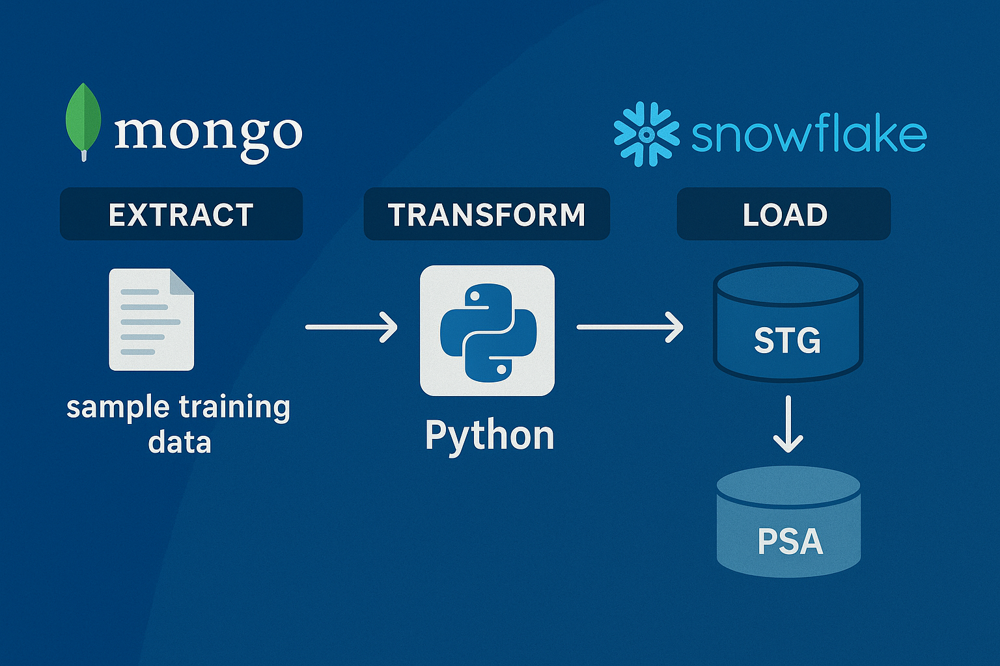
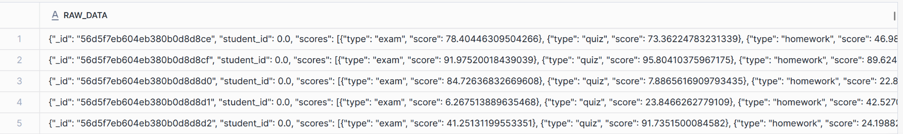
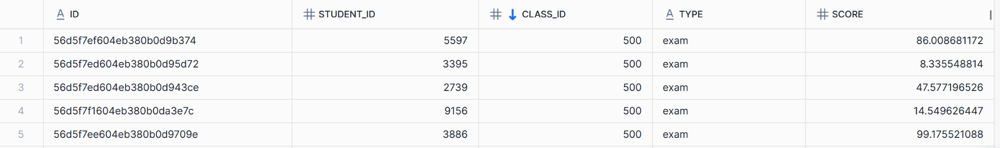

# 📊 MongoDB → Snowflake ETL Pipeline  

## 📌 Problem Statement  
Many organizations store **semi-structured JSON data** in **MongoDB**.  
While MongoDB is great for application storage, analysts need this data in **Snowflake** for BI, reporting, and analytics.  

The challenges are:  
- MongoDB documents often contain **nested arrays** (e.g., exam/quiz/homework scores).  
- Snowflake requires **structured, tabular data** for querying.  
- We must ensure **data quality** (row counts match before loading into production).  

---

## 🎯 Solution  
This project implements a **Python-based ETL pipeline** to move data from **MongoDB** to **Snowflake** in a reliable and structured way.  

**Pipeline Workflow:**  
1. Extract documents from MongoDB  
2. Load raw JSON into a **Snowflake staging table**  
3. Validate row counts between MongoDB and Snowflake staging  
4. If counts match, transform and load the data into a ** Persistent Staging Area** table. Below is high level overview




## Demo: 

https://github.com/user-attachments/assets/d1a4d26c-e532-4dd6-a69c-0840b0fbf542


---

## 🏗️ Data Example  

### MongoDB Document  
```json
{
  "_id": "56d5f7eb604eb380b0d8d8ce",
  "student_id": 0,
  "class_id": 339,
  "scores": [
    {"type": "exam", "score": 78.40},
    {"type": "quiz", "score": 73.36},
    {"type": "homework", "score": 46.98}
  ]
}
```

### Final PSA Table in Snowflake

| ID                        | STUDENT_ID | CLASS_ID | TYPE     | SCORE  |
|----------------------------|-----------|----------|---------|--------|
| 56d5f7eb604eb380b0d8d8ce  | 0         | 339      | exam    | 78.40  |
| 56d5f7eb604eb380b0d8d8ce  | 0         | 339      | quiz    | 73.36  |
| 56d5f7eb604eb380b0d8d8ce  | 0         | 339      | homework| 46.98  |


### Project Structure 

    mongo_to_snowflake/
    │── .env                 # Environment variables (not committed to GitHub)
    │── config.py            # Load secrets and settings from .env
    │── mongo_utils.py       # MongoDB connection & extraction logic
    │── snowflake_utils.py   # Snowflake connection & load logic
    │── pipeline.py          # Orchestrates ETL flow
    │── main.py              # Entry point for running pipeline
    │── requirements.txt     # Python dependencies
    │── README.md            # Project documentation


### The pipeline will:

✅ Connect to MongoDB

✅ Extract documents

✅ Load raw data into Snowflake staging

✅ Validate row counts

✅ If counts match → transform & load into PSA schema


### Features

✅ Modular Python design (easy to extend & maintain)

✅ Secrets managed via .env (secure & configurable)

✅ Data validation with row count check

✅ Automatic flattening of nested arrays into structured rows

### Results

STG Results



PSA Results



### 📊 Future Enhancements

Add logging to file.

Add Airflow/Dagster for orchestration & scheduling.

Support multiple MongoDB collections → Snowflake tables.
